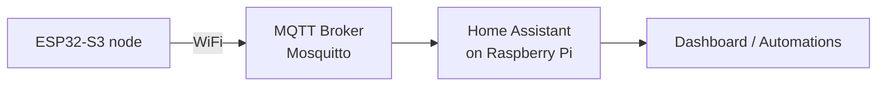

# Home Assistant Integration

This document explains how to connect this ESP32-S3 sensor node to a
[Home Assistant](https://www.home-assistant.io/) server using MQTT (with WiFi
as the transport), so that PM (PM1, PM2.5, PM10), temperature and humidity
readings automatically appear in Home Assistant.

## How it works

The firmware uses Home Assistant's native **MQTT Discovery** protocol:

1. After the node connects to WiFi, it publishes a *retained* discovery
   message for each sensor entity on the
   `<discovery_prefix>/sensor/<node>/<sensor>/config` topic.
2. Every time sensor data is read (PM, temperature or humidity), the firmware
   publishes the raw value to that entity's *state* topic
   `<discovery_prefix>/sensor/<node>/<sensor>/state`.
3. Home Assistant's MQTT integration receives the discovery messages, creates
   the entities automatically, and keeps them updated from the state topics.

The integration uses its own dedicated MQTT client, so it does **not**
interfere with the existing sensors.AFRICA telemetry MQTT client.



## Topic structure

| Entity      | Discovery topic                                          | State topic                                          |
|-------------|----------------------------------------------------------|------------------------------------------------------|
| Temperature | `homeassistant/sensor/<node>/temperature/config`         | `homeassistant/sensor/<node>/temperature/state`      |
| Humidity    | `homeassistant/sensor/<node>/humidity/config`            | `homeassistant/sensor/<node>/humidity/state`         |
| PM1         | `homeassistant/sensor/<node>/pm1/config`                 | `homeassistant/sensor/<node>/pm1/state`              |
| PM2.5       | `homeassistant/sensor/<node>/pm25/config`                | `homeassistant/sensor/<node>/pm25/state`             |
| PM10        | `homeassistant/sensor/<node>/pm10/config`                | `homeassistant/sensor/<node>/pm10/state`             |

Where `<node>` is the lowercase device identifier printed on the serial
monitor at boot, e.g. `esp32-19271g2328be`.

State payloads are plain numbers, e.g. `23.50`, `45.10`, `12.30`.

## Prerequisites

- A Raspberry Pi (3/4/5 recommended) with Home Assistant installed.
- The ESP32-S3 node and the Raspberry Pi on the **same network**.
- A configured MQTT broker reachable from the node.
- PlatformIO (VS Code) with this project open.

## Step 1 — Install Home Assistant on a Raspberry Pi

The easiest method is **Home Assistant OS**:

1. Download the appropriate image from
   <https://www.home-assistant.io/installation/raspberrypi>.
2. Flash it to a microSD card using the [Raspberry Pi Imager](https://www.raspberrypi.com/software/).
3. Insert the SD card into the Pi, power it on, and wait a few minutes.
4. Open `http://homeassistant.local:8123` (or the Pi's IP address) in a
   browser and complete the onboarding wizard.

> Alternative installs (Home Assistant Supervised, Container, Core) also work;
> this guide assumes Home Assistant OS because it includes the add-on store.

## Step 2 — Install and configure an MQTT broker (Mosquitto)

Home Assistant needs an MQTT broker to receive the node's messages.

1. In Home Assistant, go to **Settings → Add-ons → Add-on Store**.
2. Install the **Mosquitto broker** add-on.
3. Open the Mosquitto add-on **Configuration** tab and create an MQTT user:

   ```yaml
   logins:
     - username: esp32
       password: a-strong-password
   ```

4. Set **Network → Host** or keep the default (the add-on usually exposes port
   `1883`).
5. Start the add-on and enable **Start on boot** and **Watchdog**.

> Prefer a strong password and keep it secret. You will enter the same
> username/password in the firmware configuration in Step 4.

## Step 3 — Enable the MQTT integration in Home Assistant

1. Go to **Settings → Devices & Services → Add Integration**.
2. Search for and select **MQTT**.
3. Enter the broker details:

   | Field               | Value                                  |
   |---------------------|----------------------------------------|
   | Broker              | `homeassistant.local` or the Pi IP     |
   | Port                | `1883`                                 |
   | Username            | `esp32` (from Step 2)                  |
   | Password            | your password from Step 2              |

4. Click **Submit**. The integration should connect immediately.

## Step 4 — Configure the firmware

Edit `src/global_configs.h` and update the **Home Assistant** section:

```cpp
#define HA_ENABLE 1
#define HA_MQTT_BROKER "192.168.1.50"   // Home Assistant / Mosquitto IP or hostname
#define HA_MQTT_PORT 1883
#define HA_MQTT_USERNAME "esp32"        // set if your broker requires auth
#define HA_MQTT_PASSWORD "a-strong-password"
#define HA_DISCOVERY_PREFIX "homeassistant"
```

- `HA_ENABLE` — `1` to turn the integration on, `0` to disable it.
- `HA_MQTT_BROKER` — the IP address or hostname of your broker (e.g. the Pi's
  IP `192.168.1.50`, or `homeassistant.local`).
- `HA_MQTT_USERNAME` / `HA_MQTT_PASSWORD` — leave empty if your broker allows
  anonymous connections.

> The WiFi network the node joins is configured separately via
> `WIFI_STA_SSID` / `WIFI_STA_PWD` (compile-time) or through the device's
> captive portal on first boot.

## Step 5 — Build and flash

1. Connect the ESP32-S3 to your computer.
2. In PlatformIO, select the `esp32_s3_quectel_v4` environment.
3. Click **Upload and Monitor**.

Once flashed, the serial monitor should show:

```
[HA] Home Assistant integration enabled -> broker 192.168.1.50:1883
[HA] Connected to MQTT broker 192.168.1.50:1883 as esp32-xxxxx-ha
[HA] Discovery published: homeassistant/sensor/esp32-xxxxx/temperature/config
...
[HA] temperature -> 23.50
[HA] humidity -> 45.10
[HA] pm25 -> 12.30
```

## Step 6 — Verify entities in Home Assistant

1. Go to **Settings → Devices & Services**.
2. Open the **MQTT** integration.
3. You should see a device named `Sensors Africa Node <CHIPID>` with five
   sensor entities: Temperature, Humidity, PM1, PM2.5 and PM10.
4. Open each entity to confirm it shows a recent value and state class
   `measurement`.

Entities are created once from the retained discovery messages and persist
across node restarts. If they do not appear, see Troubleshooting below.

## Step 7 — Add the sensors to a dashboard

1. Go to **Overview → Edit Dashboard → Add Card**.
2. Choose **Entities** (or **Gauge** for PM values).
3. Search for `Temperature`, `Humidity`, `PM2.5`, etc. and add them.

You can now build automations, alerts and history graphs on top of these
entities.

## Troubleshooting

- **No `[HA] ...` messages on the serial monitor**
  - Confirm `HA_ENABLE 1` and `HA_MQTT_BROKER` are set in
    `src/global_configs.h` and the firmware was re-flashed.

- **`[HA] WiFi not connected`**
  - Confirm the node successfully joined the same network as the Pi.
  - Check `WIFI_STA_SSID` / `WIFI_STA_PWD` or reconfigure via the captive
    portal.

- **`[HA] MQTT connect failed, rc=5` (or rc=4)**
  - Wrong username/password, or the broker refuses the connection. Re-check
    Step 2 and Step 4 values match.
  - `rc=5` = not authorised, `rc=4` = bad client ID/protocol.

- **Entities don't appear in Home Assistant**
  - Make sure the **MQTT integration** is enabled and connected (Step 3).
  - Discovery messages are retained; restart the node to re-publish them, or
    reboot Home Assistant.
  - Confirm the discovery prefix matches: firmware `HA_DISCOVERY_PREFIX`
    defaults to `homeassistant`, which is Home Assistant's default.

- **Values show `unavailable`**
  - The node only publishes when a sensor reading succeeds. Ensure the DHT22
    and PMS5003 are wired correctly and readings appear on the serial monitor.
  - Check the broker is reachable from the node (`ping` the Pi IP from the
    node's network).

## Notes / limitations

- WiFi is used as the transport for this integration. GSM MQTT is out of scope
  for this first iteration.
- The integration publishes each reading as it is sampled; in power saving
  mode this follows the configured `sampling_interval`.
- PM entities use Home Assistant's `pm1`, `pm25` and `pm10` device classes and
  report values in `µg/m³`.
